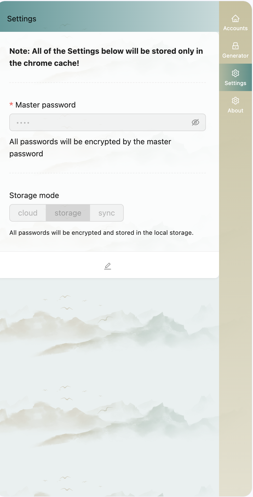

# Accounts-Keeper

用于账号记录的 `chrome` 插件，基于 `react` + `ant design`  + `tailwind` + `leanCloud` 实现。
--- 
## 应用场景

需求来源于我。出于对 `chrome` 自带的密码存储的不信任，加上学习 `Web 3.0` 期间接触到大量场景都需要记录账密，所以萌生了开发这个插件的想法。

## 功能
- 账号记录增删改查。
- 密码加密存储。 基于用户设置的“主密码”保护账号密码，<strong>主密码不存储在服务器上</strong>，仅在本地浏览器中存储。
- 数据可选择性存储在：
  - 默认：chrome storage local中。
  - 可选：chrome storage sync 中，数据将同步到其他设备chrome浏览器。
  - 可选：leanCloud中。免费存储空间，数据安全性高。 【推荐，密码加密存储，安全性也高】
- 账号记录查询，支持模糊查询。
- 密码生成器，支持随机密码生成。

## 部分截图
  
  
  

## 安装使用

- 下载项目打包后，在chrome浏览器中打开`chrome://extensions/`，勾选开发者模式，点击`加载已解压的扩展程序`，选择 dist 文件夹。
  - 待优化后考虑将插件发布到chrome商店。
- 打开插件设置页面，配置存储位置和主密码。
- 打开插件主页面，开始记录账号密码。

## 配置

- 主密码：在插件设置页面设置主密码，密码将被SHA256加密，并存储在浏览器本地。
- 存储位置：默认存储在chrome storage local中，可选leanCloud存储。
- 存储位置配置：
  - 若leanCloud存储，需要在插件设置页面配置leanCloud的api_key和api_secret。
  - 若chrome storage local存储，不需要配置。 也可切换至chrome storage sync存储。
  - 若chrome storage sync存储，需要在chrome浏览器设置中开启同步。
  

  
## TODO

### 功能
- 页面右键菜单，
  - 添加账号至插件中保存
  - 一键生成随机密码。
  - 选择账号填充当前页表单。
- 账号记录导出，支持导出为csv文件。
- 账号记录导入，支持导入csv文件。
  
### 客户端
  - 小程序